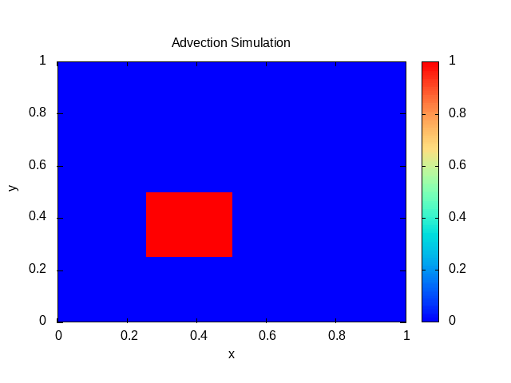

# Advection Simulation using Finite Volume Method

## Overview
This project implements a 2D advection simulation using the finite volume method in C++. The simulation leverages OpenMP for parallelism and outputs simulation frames as text files that can be visualized using Gnuplot. Two numerical flux schemes are available: Upwind and Central.




## Features
- **2D Finite Volume Solver:** Implements a solver for simple CFD equations.
- **Numerical Flux Schemes:** Use Upwind and Central flux calculations.
- **Parallel Computing:** Uses OpenMP to improve the performance.
- **Visualization:** Outputs frame data that can be animated with Gnuplot.

## Requirements
- **C++ Compiler:** Support for C++20.
- **CMake:** 
- **OpenMP:** in option
- **Gnuplot:** To generate animations from simulation output.

## Installation and Build Instructions

1. **Clone the repository:**
```bash
   git clone https://github.com/sbstndb/maillagix
   cd maillagix
```

2. **Create a build directory and compile the project**
```
mkdir build
cd build
cmake .. 
make
```

3. **Run the simulation**
```
./maillagix
```

4. **Visualisation with Gnuplot**

```
gnuplot plot.gp
```
This script read the files named `frame_<xxx>.txt` and produces the animation `animation.gif`.
Note : The `plot.gp` file is assuming the simulation was done with `nx == ny == 4096` and 25 frames.
Note : Gnuplot is SLOW. I will implement matplotlib and paraview scripts later.

# TODO
- [x] Add an hybrid OpenMP/MPI version
- [ ] Add MPI shared version (MPI RDMA, or SHMEM implementation)
- [ ] Improve vectorization
- [x] Add Matplotlib scripts for the output
- [ ] Add benchmarking scripts
- [ ] Add MUSCL flux
- [ ] Add Simple BCs like Neumann or Dirichlet
- [ ] Add simple CFD model (compressible Euler)
- [ ] Add test-cases
- [ ] Support 3D computations

